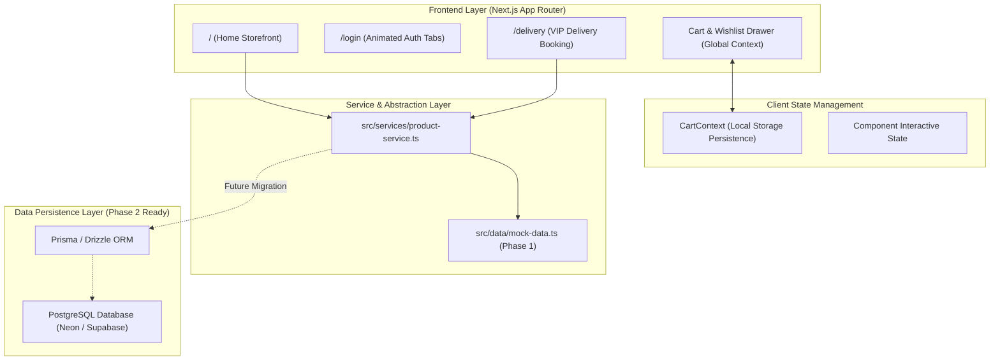

# 🛒 NexaMart — Modern Full-Stack E-Commerce Platform

[](https://nextjs.org/)
[](https://react.dev/)
[](https://tailwindcss.com/)
[](https://www.typescriptlang.org/)
[](https://www.postgresql.org/)

**NexaMart** is a production-grade, high-performance, modern e-commerce web application engineered with **Next.js (App Router, Turbopack)**, **React 19**, and **Tailwind CSS v4**. Built with scalable Clean Architecture, NexaMart delivers lightning-fast page loads, pixel-perfect UI fidelity, rich customer conversion widgets, interactive booking schedules, and a seamless abstraction layer ready for PostgreSQL database migration.

---

## 🌟 Key Highlights & Live Features

### 🛍️ 1. Dynamic E-Commerce Storefront
- **Top Announcement Bar**: Live promotional notice with pulsing badge and customer support links.
- **Search & Category Selector**: Multi-category filter dropdown with real-time responsive search.
- **Interactive Cart & Wishlist**: Slide-over drawer with item increment/decrement, tax & free-shipping thresholds, and empty-state guidance.
- **Bento Grid Hero Showcase**: 3-tier promotional layout for Furniture, Men's Fashion, and Kids' summer specials with hover-lift micro-interactions.
- **Weekly Flash Deals**: Dark teal (`#082928`) section featuring an active real-time countdown timer (`HH:MM:SS`), discount badges, ratings, and slide-up cart triggers.
- **Category Spotlight**: Circular interactive category badges with deal banners and coupon countdowns.
- **Popular Products Grid**: 10-item curated showcase with smooth "Load More" pagination.
- **Sneaker Fest Spotlight**: Live countdown spotlight paired with best-seller product grids.
- **Most Popular Sellers & Trust Propositions**: Verified store badges, customer satisfaction stats, Money-Back Guarantee, and 24/7 customer service badges.

### 🔐 2. Split-Screen Animated Authentication (`/login`)
- **Dual Column Layout**:
  - *Left*: NexaMart VIP Club branding showcase with dynamic text and watch graphic.
  - *Right*: Compact authentication portal designed for zero vertical overflow on laptops.
- **Animated Tab Switcher**: Smooth sliding pill switcher between **Sign In** and **Register**.
- **Directional Animations**: Forms transition smoothly with cubic-bezier easing (`anim-auth-slide-left` and `anim-auth-slide-right`) and staggered delays.

### 🚚 3. Dedicated VIP Express Delivery Booking (`/delivery`)
- **Shadcn-Style Components**:
  - Interactive **DatePicker** with popover calendar.
  - Custom **TimePicker** for delivery windows (Morning, Afternoon, Evening, Express).
  - Clean validation with dynamic confirmation screen and tracking ID generation.

---

## 📐 Architecture & System Workflow



---

## 🗂️ Clean Project Directory Structure

```text
nexamart/
├── public/                 # Static public assets & brand icons
├── src/
│   ├── app/                # Next.js App Router
│   │   ├── delivery/       # /delivery (VIP Express booking page)
│   │   ├── login/          # /login (Split-column animated auth)
│   │   ├── register/       # /register (Redirect to login?tab=register)
│   │   ├── globals.css     # Tailwind v4 theme, keyframes & animations
│   │   ├── layout.tsx      # Root layout with CartProvider & font config
│   │   └── page.tsx        # Homepage layout composing all sections
│   ├── components/
│   │   ├── home/           # Homepage-specific components
│   │   │   ├── hero-section.tsx
│   │   │   ├── weekly-deals.tsx
│   │   │   ├── category-showcase.tsx
│   │   │   ├── popular-products.tsx
│   │   │   ├── best-seller-section.tsx
│   │   │   ├── delivery-booking-widget.tsx (App download banner)
│   │   │   └── sellers-and-trust.tsx
│   │   ├── layout/         # Global layout components
│   │   │   ├── header.tsx  # Sticky header, search, category select, drawer toggle
│   │   │   ├── footer.tsx  # Newsletter input, brand typography, payment icons
│   │   │   └── cart-drawer.tsx # Slide-over cart drawer
│   │   └── ui/             # Reusable UI primitives
│   │       ├── button.tsx
│   │       ├── input.tsx
│   │       ├── badge.tsx
│   │       ├── calendar.tsx
│   │       ├── date-picker.tsx
│   │       ├── time-picker.tsx
│   │       ├── popover.tsx
│   │       └── product-card.tsx
│   ├── context/
│   │   └── cart-context.tsx # Global shopping cart & wishlist state
│   ├── data/
│   │   └── mock-data.ts     # Rich initial static products, categories, coupons
│   ├── services/
│   │   └── product-service.ts # Clean abstraction layer ready for DB queries
│   └── types/
│       └── index.ts         # TypeScript definitions
├── next.config.ts
├── package.json
├── tsconfig.json
└── README.md
```

---

## 🚀 Getting Started

### Prerequisites
- Node.js: `v18.18.0` or higher (Node 20+ recommended)
- Package Manager: `npm` or `pnpm`

### Installation & Local Development

```bash
# 1. Clone the repository
git clone git@github.com:Adnan4141/nexa-mart-ecommerce.git
cd nexa-mart-ecommerce

# 2. Install dependencies
npm install

# 3. Start development server
npm run dev

# 4. Open in browser
http://localhost:3000
```

### Production Build

```bash
npm run build
npm run start
```

---

## 🔮 Future Roadmap (Full-Stack Next Steps)

- [ ] **PostgreSQL Migration**: Connect database via Prisma ORM or Drizzle ORM to replace `mock-data.ts`.
- [ ] **Authentication**: Integrate NextAuth.js (Auth.js) or Supabase Auth with Google/Credentials providers.
- [ ] **Payment Processing**: Integrate Stripe Checkout / SSLCommerz / bKash payment gateway.
- [ ] **Admin Dashboard**: Manage inventory, order statuses, delivery slots, and coupons.
- [ ] **Email Notifications**: Trigger automated order confirmation emails using Resend / React Email.

---

## 📄 License
This project is open-source and available under the [MIT License](LICENSE).
